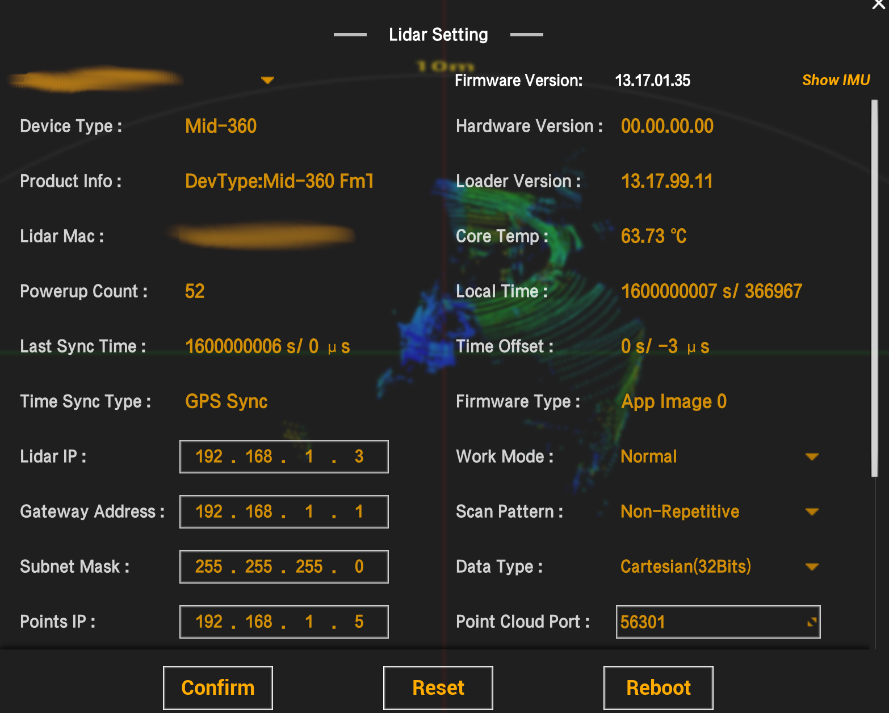

# Project that uses cheap ESP controller to generate fake GNSS NMEA data

Projects generates PPS signal to synchronize multiple LiDARs. 

## Wiring

 - D1 - PPS 
 - TX - NMEA

 ## Timestamp

- It reports timestamp from POSIX 1600000000.
- It turnovers after full UTC day

## Tested devices

- Livox mid-360 (FW 13.17.01.05)

